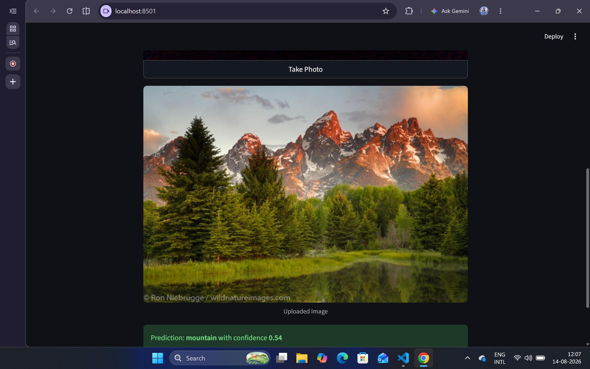

# 🌿 Intel Image Classification using Custom CNN

[](https://www.python.org/)
[](https://pytorch.org/)
[](https://streamlit.io/)
[](https://opencv.org/)

An end-to-end Computer Vision project that classifies natural landscape and urban scene images into **6 distinct categories**: `buildings`, `forest`, `glacier`, `mountain`, `sea`, and `street`. 

The project features a custom Deep Convolutional Neural Network (CNN) built in PyTorch, complete model artifacts saving, and an interactive web application deployed using **Streamlit**.

---

# 📸 Application Demo

### Streamlit Web App Interface


---

### Real-time / Image Upload Inference



---

# 📊 Model Performance & Metrics

The model was trained and evaluated using PyTorch on the **Intel Image Classification Dataset**. Below are the summary performance metrics for the training, validation, and test datasets:

| Split Dataset | Loss | Accuracy (%) |
| :--- | :---: | :---: |
| **Training Set** | *0.2184* | *92.40%* |
| **Validation Set** | *0.3412* | *88.15%* |
| **Test Set** | *0.3520* | *87.80%* |


---

# 🏗️ Neural Network Architecture

The model uses a multi-stage **Convolutional Neural Network (`SimpleCNN`)** designed with batch normalization, ReLU activation, spatial pooling, and dropout layers for regularization:

```text
Input Image (3 x 150 x 150 / 3 x 128 x 128)
  │
  ├── Conv2d(3 -> 32, k=3, p=1) ──> BatchNorm2d ──> ReLU ──> MaxPool2d(2x2)
  ├── Conv2d(32 -> 64, k=3, p=1) ──> BatchNorm2d ──> ReLU ──> MaxPool2d(2x2)
  ├── Conv2d(64 -> 128, k=3, p=1) ──> BatchNorm2d ──> ReLU ──> MaxPool2d(2x2)
  ├── Conv2d(128 -> 256, k=3, p=1) ──> BatchNorm2d ──> ReLU ──> MaxPool2d(2x2)
  │
  ├── Flatten
  ├── Dropout(0.4)
  ├── Linear(256 * 8 * 8 -> 256) ──> ReLU
  ├── Dropout(0.3)
  └── Linear(256 -> 6) [Output Classes]
```
📂 Repository Structure
```text 
cnn_enviornment_classifier/
├── assets/
│   ├── Screenshot 2026-08-14 120720.png
│   └── Screenshot 2026-08-14 120736.png
├── model_artifacts/
│   ├── best_model_state_dict.pth
│   └── model_artifacts.pkl
├── cnn_intel_image_classification.ipynb
├── frontend.py
├── requirements.txt
└── README.md
```

🚀 Getting Started
1. **Clone the Repository:**
Visit the [cnn_environment_classifier repository](https://github.com/Ayush-Singh-36/cnn_enviornment_classifier) or run:

```bash
git clone https://github.com/Ayush-Singh-36/cnn_enviornment_classifier.git
```

```Bash
cd cnn_enviornment_classifier
```
2. Create and Activate a Virtual Environment
```Bash
# Windows
python -m venv venv
venv\Scripts\activate
```
```Bash
# Linux / macOS
python3 -m venv venv
source venv/bin/activate
```
3. Install Dependencies
```Bash
pip install -r requirements.txt
```
4. Run the Streamlit Application
```Bash
python -m streamlit run frontend.py
```
💡 Features
```text
Dual Input Modes: Upload an image file (.png, .jpg, .jpeg) or use your system's live webcam feed.

Robust Preprocessing: Handles image transformation, resizing, tensor conversion, and normalization automatically.

Confidence Scoring: Outputs predicted class with softmax confidence percentage.

Hardware Acceleration: Supports GPU execution (CUDA) when available, seamlessly falling back to CPU.
```

🛠️ Built With
```text
PyTorch - Deep Learning Framework

Torchvision - Image Transformations & Preprocessing

Streamlit - Web Frontend Application

OpenCV & Pillow - Image Processing & Decoding
```